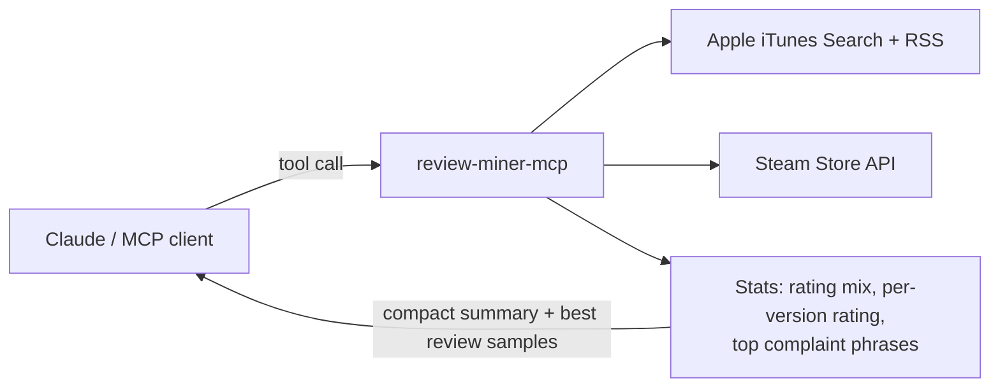

# review-miner-mcp

**Find out what users hate about your competitors.** An MCP server that mines public **App Store** and **Steam** reviews so Claude (or any MCP client) can turn thousands of complaints into product opportunities.

No API keys. No scraping. One line to install.

```
You:    What do users hate about the top health & fitness apps in Turkey?
Claude: [review_top_apps → review_compare_apps]
        • Strava: the most upvoted complaints ask for Turkish. "I was going to buy
          Premium but I'm deleting it because there is no Turkish support."
        • OKOK (smart scale): 61% of recent reviews are negative. You have to watch
          ads before the app shows your own weight.
        • MAC+: login and verification-code errors ("hata veriyor") dominate.
        • HUAWEI Health: can't log in after switching phones or after updates.
```
<sub>Summarized from real tool output: Turkish App Store, 1 Oct 2026, 150 recent reviews per app.</sub>


## Why

| You want to know | Without it | With review-miner |
|---|---|---|
| Why an app's rating dropped | Scroll reviews by hand | `rating_by_version` shows which update broke it |
| What a whole category fails at | Read 5 apps × 500 reviews | One call compares them side by side |
| Whether an idea has demand | Guess | Real complaints, with quotes and counts |

## How it works



The server does the cheap, deterministic part (fetching, counting, phrase extraction). The model does the interpretation. Only the most helpful review texts are returned, so your context window is not flooded.

## Install

Requires [uv](https://docs.astral.sh/uv/).

**Claude Code**
```bash
claude mcp add review-miner -- uvx --from git+https://github.com/alialtunar/review-miner-mcp review-miner-mcp
```

**Claude Desktop / Cursor** (`claude_desktop_config.json` / `.cursor/mcp.json`)
```json
{
  "mcpServers": {
    "review-miner": {
      "command": "uvx",
      "args": ["--from", "git+https://github.com/alialtunar/review-miner-mcp", "review-miner-mcp"]
    }
  }
}
```

## Tools

| Tool | What it does |
|---|---|
| `review_top_apps` | Current top charts: App Store by category (free / paid / grossing) or Steam top sellers / new releases |
| `review_search_apps` | Find an app or game and get its ID |
| `review_fetch` | Recent reviews for one app: rating mix, rating per version, top complaint phrases, most helpful texts |
| `review_compare_apps` | 2–8 competitors side by side, App Store and Steam mixed |

**Prompts:** `find_opportunities` (category → product gaps), `competitor_teardown` (one app, love vs hate).

Every tool supports `country` (e.g. `tr`, `de`, `us`) and `response_format` (`markdown` / `json`).

## Try these

- "Compare the reviews of the top 5 finance apps in Turkey. What does every one of them get wrong?"
- "Did Duolingo's latest version lower its rating? Show rating by version."
- "What do negative Steam reviewers of Cyberpunk 2077 complain about, and how many hours had they played?"
- "Run find_opportunities for health-fitness in Germany."

## Limits (set by the sources)

- App Store: most recent ~500 reviews per country (Apple's feed limit).
- App Store: Apple's review feed is sometimes empty for an app/country for a while. The server retries equivalent feed URLs automatically; if all are empty it tells you so instead of reporting "no reviews". Retrying a few minutes later or trying another country usually works.
- Steam: most recent reviews, filtered by language (`english`, `turkish`, `all`...).
- Results are cached for 15 minutes; concurrency is capped to stay polite.

## Development

```bash
uv sync --extra dev
uv run pytest                          # offline tests with mocked APIs
uv run python scripts/smoke_live.py    # live check against Apple and Steam
npx @modelcontextprotocol/inspector uv run review-miner-mcp   # click-through UI
uv run --with rich python scripts/demo.py finance tr        # terminal demo (vhs docs/demo.tape records the GIF)
```

MIT © Ali Altunar
